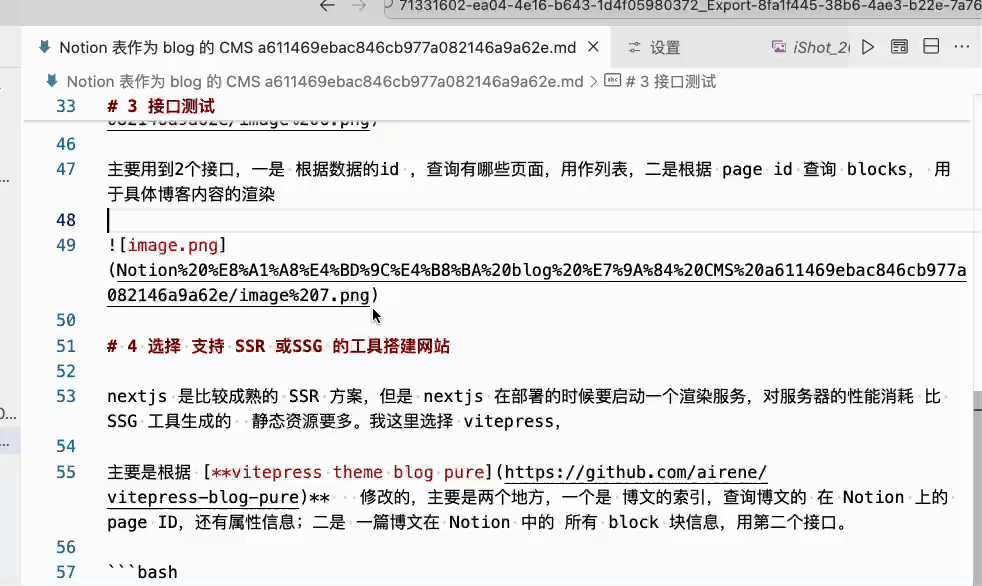
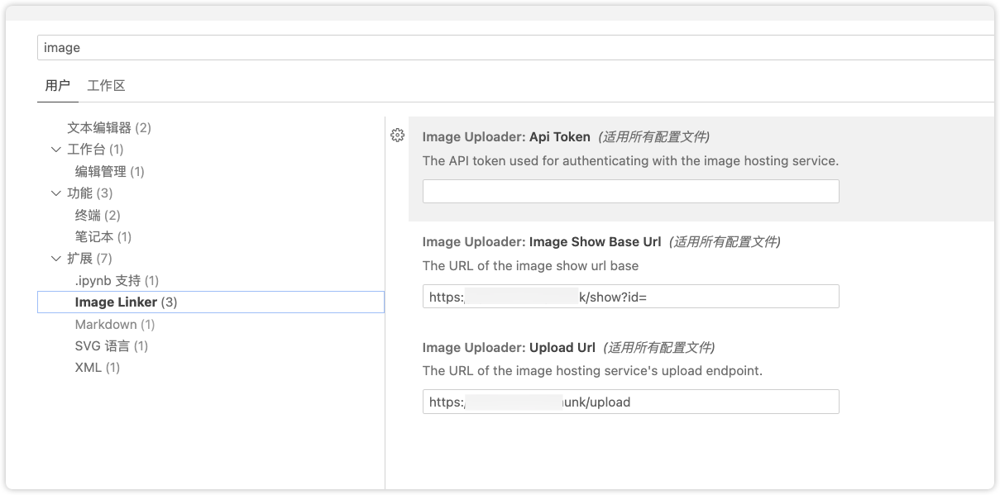

# image-linker 

a vscode extension to upload images in markdown to the image server and replace the local image links with the service links.

## preview



## build

```
npm install

npm run build

```

## config

